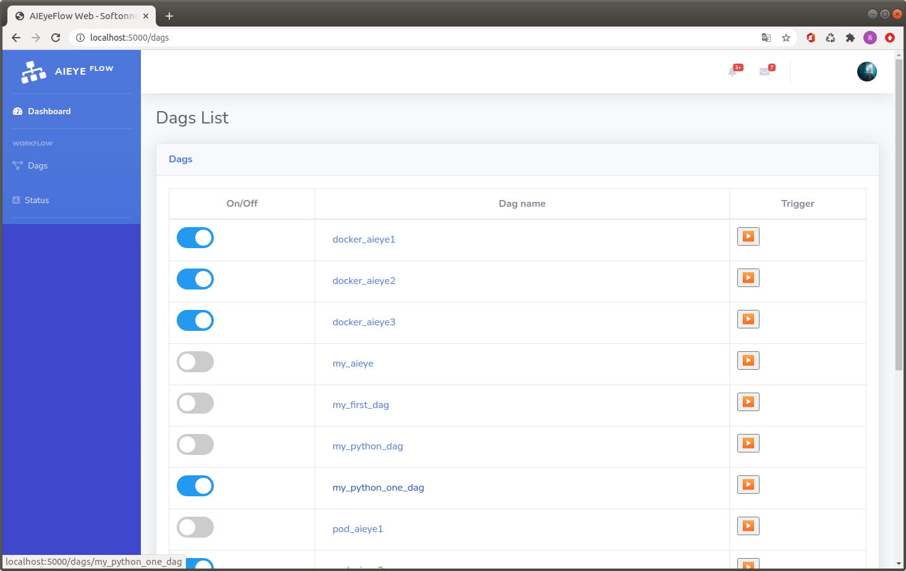
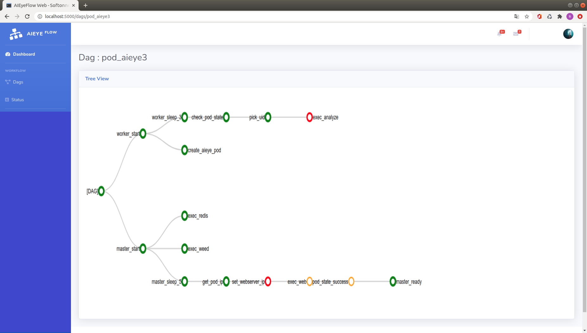

# GS-aiflow

> *GS-aiflow AI/ML Workflow Management Framework*

GS-aiflow is the workflow management Framework for machine learning operations - pipelines, training and inferences.
When workflows are defined, they become more maintainable, versionable, testable, and collaborative.
With GS-aiflow you can use workflows as directed acyclic graphs (DAGs) of tasks. The GS-aiflow scheduler executes your tasks on an array of workers while following the specified dependencies. 

Aiflow offers a set of lightweight environments that can be used with any existing machine learning application or library (TensorFlow, PyTorch, Keras, ONNX etc), wherever you currently run ML/DL code (e.g. in notebooks, standalone applications).

## Requirements
|                      | Main version (dev)        | Stable version (1.5)     |
| -------------------- | ------------------------- | ------------------------ |
| Python               | 3.6, 3.7, 3.8, 3.9        | 3.6, 3.7, 3.8, 3.9       |
| Docekr               | 18.09.x, 20.10.x          | 18.09.x, 20.10.x         |
| Kubernetes           | 1.20, 1.19, 1.18          | 1.20, 1.19, 1.18         |
| MySQL                | 5.7, 8                    | 5.7, 8                   |
| MariaDB              | 10.3, 10.4, 10.5          | 10.3, 10.4, 10.5         |

## Installation

## System Architecture

- redis: message broker in GS-aiflow
- airflow: backend workflow framework in GS-aiflow
  
## Features
- manage workflow with DAG
- automate configuration and management of tasks
- work with Kubernetes and Dockers
- optimize and accelerate ML/DL inferencing and training for fastest responce time

## User Interface

### Task view

### Graph view

## Contributing
If you're interested in being a contributor and want to get involved in developing the GEdge Platform code, please see DOCUMENTATIONs for details on submitting patches and the contribution workflow.

## Community
We have a project site for the GEdge Platform. If you're interested in being a contributor and want to get involved in developing the Cloud Edge Platform code, please visit [GEdge Plaform](https://gedge-platform.github.io) Project site

## License
GEdge Platform is under the Apache 2.0 license. See the [LICENSE](./LICENSE) file for details.
