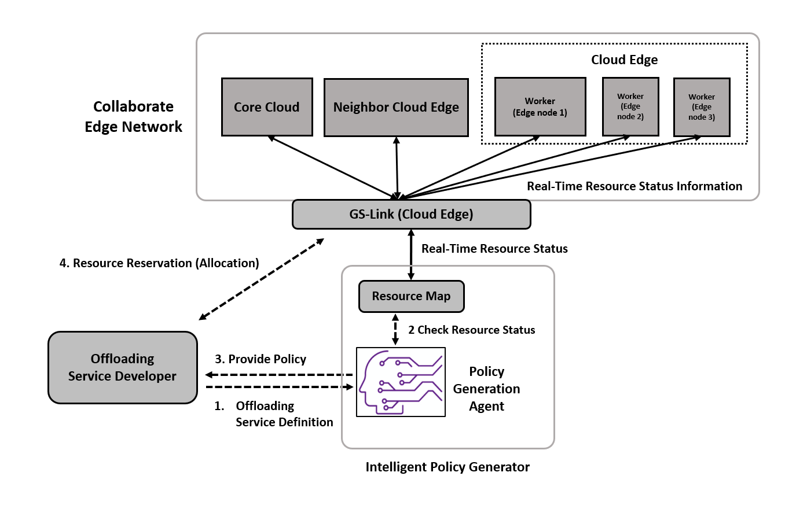
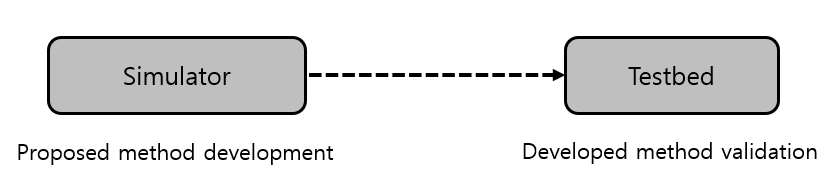

# GS-LinkHQ

`GS-LinkHQ` is a reinforcement learning based agent that generates policy for both computation offloading and distributed caching in the [`GEdge-Platform`](https://github.com/gedge-platform/gedge-platform). The policy supports horizontal (between cloud edge and neighbor cloud edge) and vertical (between cloud edge and core cloud) collaboration.




## The policy for computaion offloading

- Providing offloading service developers (or service providers) with edge resource allocation policies and capabilities required to implement policies for offloading service development
  - Supporting offloading service provisioning: Optimized resource allocation
- Resource allocation policy
  - Where to deploy
  - How to deploy
  - Collaborative deployment or Noncollaborative deployment
    - Horizontal, vertical and horizontal + vertical collaboration
- Policy provide point
  - Service development point
  - When quality of service decreases → When scale out or scale up
  - Choosing load balancing method


The information considered to decide the policy is as follows.

- Offloading service definition
  1. CPU specification
  2. GPU usage and specification
  3. Storage/cache specification
  4. Service properties (network delay sensitive, availability sensitive, etc.)
- Cloud edge (include neighbor edge's information) system resource status information
  1. CPU usage
  2. GPU usage
  3. Storage/cache usage
  4. Network quality status (latency) (Bet CEs, Bet CE and CC)
  5. Deployed offloading services quality


## Components

GS-LinkHQ consists of three subprojects



- [`vedge`](./vedge): Develop proposed methods first with simulator
  -  Virtual Cluster edge(Single cluster based edge) environment
    - Include resource map, network performance map, and offloading service(task) definition
    - Use DQN, PPO with intelligent technology
- [`agent`](./agent): Reinforcement learning agent developed with the above two projects
  - Real-world (`GEdge-Platform`) environment


### Requirements
- Nvidia Docker
- Docker compose

### Usage

#### 1. Clone repository
```shell
git clone https://github.com/gedge-platform/gs-linkhq.git
```

#### 2. Build images and run containers
```shell
docker compose up --build
```
