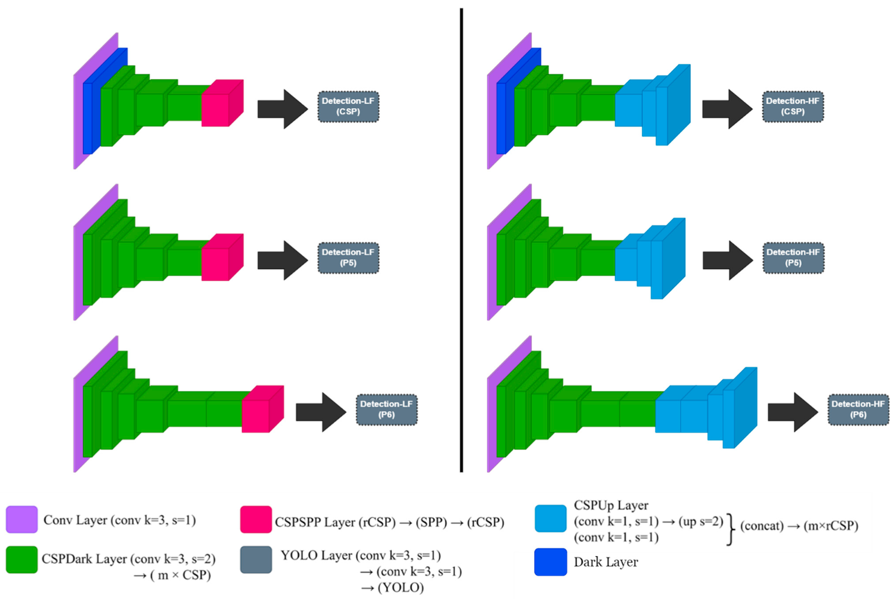

# GS-Msa

> GS-Msa AI/ML Object detection service

GS-msa is a microservice-based object detection deep learning service. By reconstructing the existing monolithic deep learning model, scalability is enhanced and flexible deployment is possible. It also shows improved inference accuracy by applying different networks according to the information in the image.

## Contents
* Requirements  
* Architecture  
* Installation  

## Requirements
|            | Version (Recommended) |  
|------------|:---------------------:|  
| Python     |          3.8          |  
| Cuda       |          11.4         |  
| Kubernetes |          1.22         |  
| Opencv     |         4.4.0         |  
| Flask      |         2.0.2         |  

## Architecture

GS-Msa consists of five main parts: FrontMicroservice, Preprocessing Microservice, Inferencing Microservice, Postprocessing Microservice, and Metadata Sharing service.
The figure below describes in more detail the structure and roles of these independently operating microservices. 


To make efficient use of resources, different networks are applied depending on the size of the image, which are processed in parallel. The network is based on the Scaled-YOLOv4 network, which is modified to specialise in high-level features and low-level features of the images. 




## Installation

For Training
```bash
python3 train.py --batch-size 4 --img 640 640 --data data/person.yaml --cfg yolov4-csp-medium-edit2.yaml --weights '' --sync-bn --device 0 --name yolov4-csp-small2 --epochs 200
```

For Inferencing

```bash
kubectl apply -f ./yaml/persistant_volume.yaml
kubectl apply -f ./yaml/persistant_volume_claim.yaml
kubectl apply -f ./yaml/yolo_preprocess_220411.yaml
kubectl apply -f ./yaml/preprocess-svc.yaml
kubectl apply -f ./inference_220411.yaml
kubectl apply -f ./postprocess_220411.yaml
```

Inferred after accessing the web by entering the IP specified to perform the webpage and the port number specified by the service.
