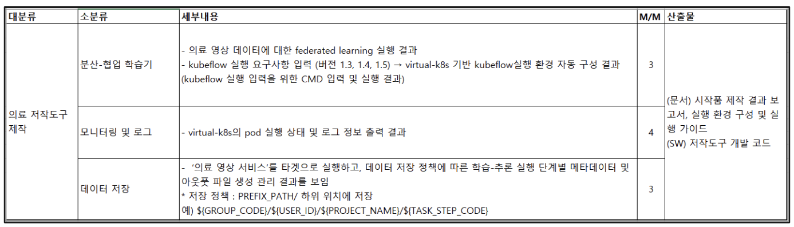

# Federated Learning
## Description
국책 과제를 수행하기 위한 파일들, 결과를 저장하기 위한 폴더입니다.   


## Prerequisite
- Python == 3.8.x

## Quickstart
1. Install Packages
    ```bash
    pip install -r requirements.txt
    ```

1. Change Federated Learning Server Endpoint  
    *fl-tensorflow.py* 파일 맨 밑에 서버의 endpoint를 써줍니다. 서버의 기본 포트번호는 **8080**입니다.
    ```python
    fl.client.start_numpy_client(server_address="{fl-server-host}:{fl-server-port}", client=client)
    ```

1. Run Federated Learning Server
    ```bash
    python fl-tensorflow-server.py
    ```

1. Run Two Federated Learning Clients
    ```bash
    python fl-tensorflow-client.py
    # open another terminal
    python fl-tensorflow-client.py
    ```

1. Run Transfer Learning   
    tensorflow 예제만 구현되어 있습니다. 위에서 연합학습한 모델을 다운로드 받아서 한번 더 학습하는 예제입니다.
    ```bash
    python transfer-learning.py
    ```
