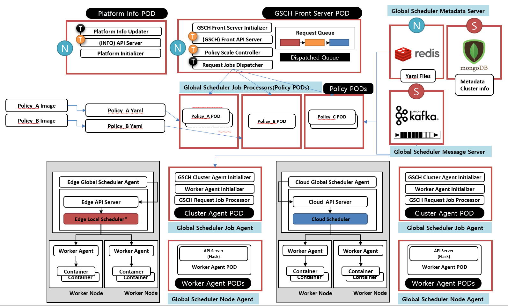
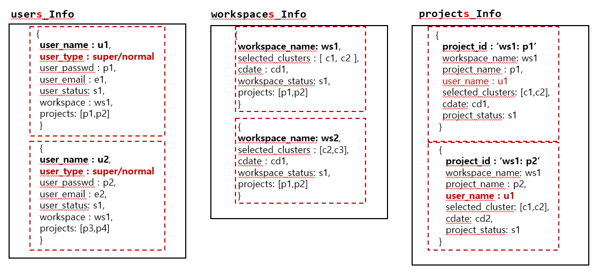
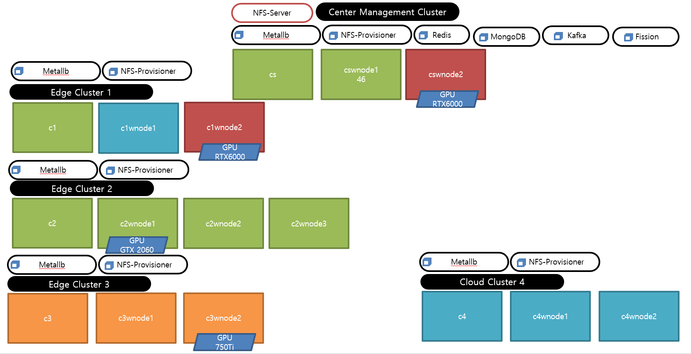

# GE-Global Scheduler 3.0

## For Multiple Edge Clusters and Cloud Cluster

- Can Apply yaml for 3L Clusters (Edge Cluster / Near Edge Cluster / Cloud Cluster)  
- Updated Center Management Cluster 

## Updated GEdge-Scheduler Main Core  

- Add New Platform info POD at Center Management Cluster 
- Changed to Run Front Server POD and GEdge Scheduler Policy PODs All at Once

## Updated GEdge-Scheduler Source Code for Multiple Users and Workspace, Project 

- Add Newly Multiple Users
- Workspace is created from Cluster Set ( User Selected Clusters) 

## Set 5 clusters for Developing System  
- Set Three Edge Clusters 
- Set One Cloud Cluster (not real cloud) 

## Add New GEdge Schedluer Policy 

- (G)MostRequestedPriority for 3LT 
- (G)LowLatencyPriority for 3LT
- GSelectCluster for 3LT

